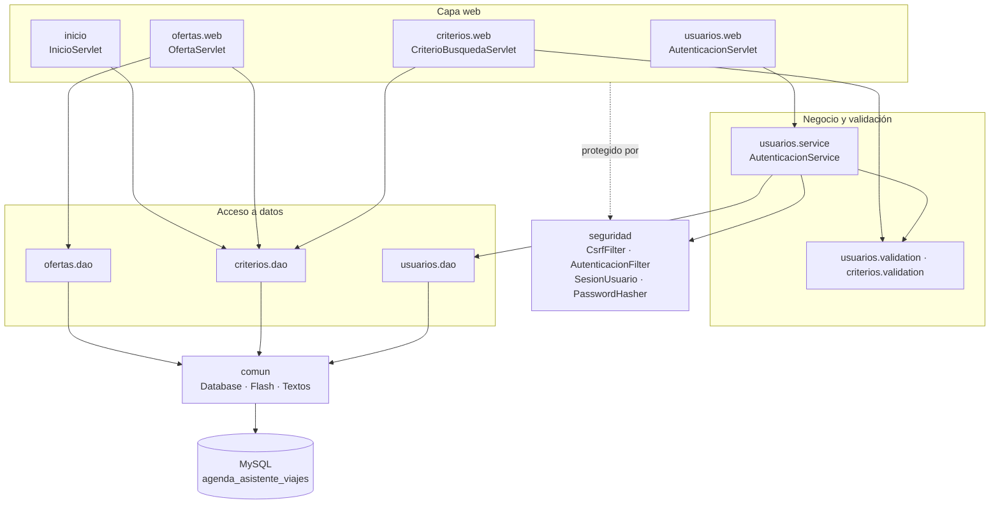
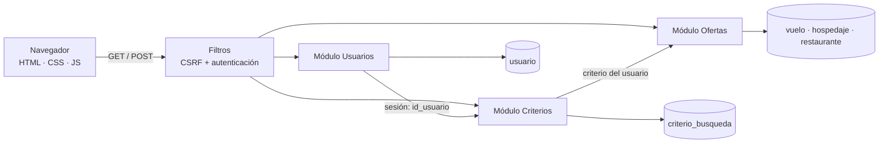
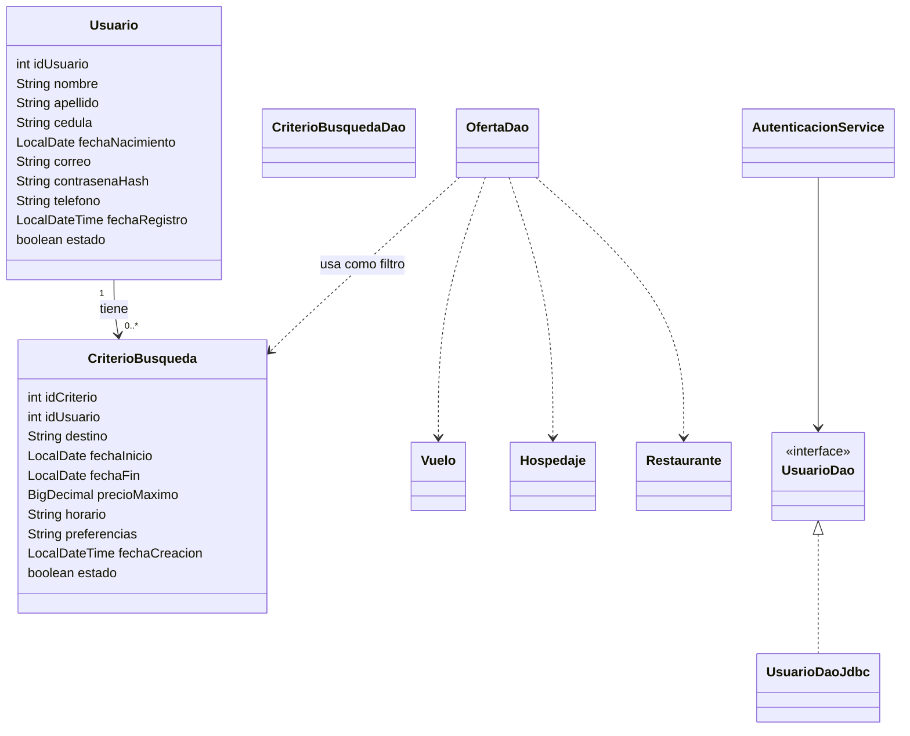

# Arquitectura

Aplicación web **Java 17 + Servlets/JSP (Jakarta EE 10)** empaquetada como WAR con Maven y desplegada en **Apache Tomcat 10.1**. Persistencia con **JDBC** sobre **MySQL**. El proyecto es un monolito modular: un solo WAR con tres módulos, cada uno en su paquete.

## Capas y tecnologías

| Capa | Responsabilidad | Tecnología / librería | Paquetes |
| --- | --- | --- | --- |
| Presentación | Páginas, formularios, mensajes | JSP, JSTL 3.0 (`c`, `fmt`), HTML5, CSS3, JavaScript sin librerías | `WEB-INF/views`, `assets` |
| Control | Recibir GET/POST, validar el flujo, elegir la vista | Servlets (Jakarta Servlet 6.0) | `*.web`, `inicio` |
| Seguridad transversal | Sesión, autenticación, CSRF, cabeceras | Filtros de servlet, PBKDF2 del JDK | `seguridad` |
| Negocio | Reglas del registro e inicio de sesión | Clases Java | `usuarios.service`, `*.validation` |
| Acceso a datos | Consultas SQL parametrizadas | JDBC, `PreparedStatement`, MySQL Connector/J 9.1 | `*.dao`, `comun.Database` |
| Datos | Tablas y restricciones | MySQL 8 (`agenda_asistente_viajes`) | `sql/esquema.sql` |

No se usan frameworks adicionales (Spring, Hibernate, etc.): el componente formativo trabaja con Servlets, JSP y JDBC directamente.

## Paquetes (`src/main/java/co/edu/sena`)

## Componentes por módulo

La **integración** entre módulos ocurre en tres puntos:

1. **Usuarios → Criterios:** el `id_usuario` de cada criterio sale de la sesión autenticada, no del formulario. Un usuario solo ve, edita y elimina sus criterios.
2. **Criterios → Ofertas:** `OfertaServlet` carga el criterio (verificando que sea del usuario) y `OfertaDao` busca vuelos, hospedajes y restaurantes que cumplen su destino, fechas y precio máximo.
3. **Seguridad → todos:** `AutenticacionFilter` protege `/inicio`, `/criterios/*` y `/ofertas/*`; `CsrfFilter` valida todo POST.

## Diagrama de clases (modelo de dominio)

`Vuelo`, `Hospedaje` y `Restaurante` no se relacionan con el criterio mediante claves: se buscan por coincidencia de destino, fechas y precio. Las tablas puente del SQL original (`criterio_vuelo`, etc.) no se usan en esta entrega.

## Patrones de diseño aplicados

| Patrón | Dónde |
| --- | --- |
| MVC | JSP (vista), Servlets (controlador), clases `model` |
| DAO | `UsuarioDao`/`UsuarioDaoJdbc`, `CriterioBusquedaDao`, `OfertaDao` |
| Service | `AutenticacionService` (probado con un DAO en memoria) |
| Filtro / Intercepting Filter | `CsrfFilter`, `AutenticacionFilter` |
| Post/Redirect/Get | Todo POST exitoso redirige; `Flash` conserva el mensaje |
| Plantilla de vista | `layout/cabecera.jspf` y `layout/pie.jspf` incluidos en cada JSP |
| Synchronizer token | Token CSRF en sesión y campo oculto `_csrf` |

## Buenas prácticas

- Nombres de paquetes por módulo (`usuarios`, `criterios`, `ofertas`) y dentro de cada uno por capa (`model`, `dao`, `service`, `validation`, `web`).
- Consultas siempre con `PreparedStatement`; el texto del usuario nunca se concatena en SQL. Los comodines `%` y `_` del destino se escapan.
- Salida de datos en las vistas con `<c:out>` (escapa HTML).
- Validación en el servidor (autoridad) y en el navegador (comodidad).
- Código y mensajes en español, igual que el dominio del proyecto.
