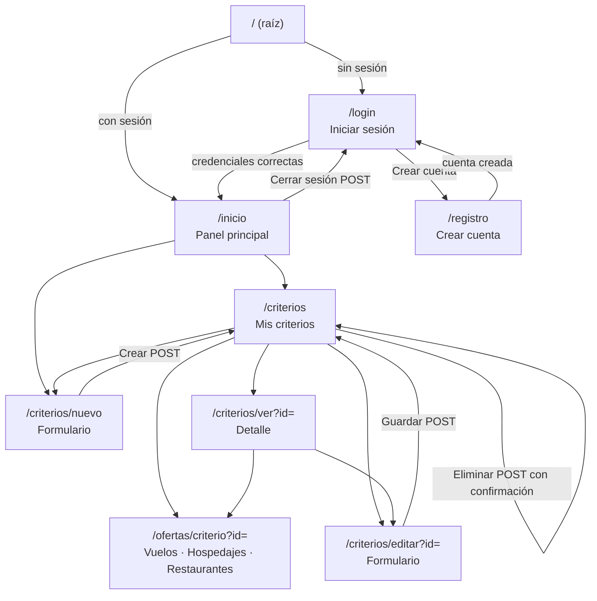

# Mapa de navegación

| Pantalla | Quién accede | Enlaces visibles |
| --- | --- | --- |
| Login y registro | Cualquier visitante | Entre sí |
| Inicio, criterios, detalle, formularios y ofertas | Solo usuarios con sesión | Menú superior (Inicio, Criterios de búsqueda, Cerrar sesión) |
| Error (400, 403, 404, 405, 500) | Cualquiera | Volver al inicio |
